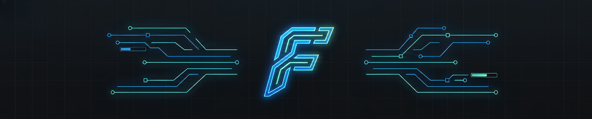

# 🖱️ FlexClicker



A lightweight, high-performance, and feature-rich autoclicker built natively in C++ using the WinAPI. Designed to automate both mouse clicks and keyboard presses with precision and zero overhead.

---

## ⚠️ Disclaimer & Antivirus Notes

> [!WARNING]
> **Anti-Cheat Warning:** Use this tool responsibly. Using autoclickers in multiplayer games may violate their Terms of Service and result in a ban. The "Jitter" feature reduces detection risks but does not guarantee immunity.

> [!IMPORTANT]
> **False Positives:** This application uses low-level Windows APIs (SendInput, GetAsyncKeyState, and high-resolution timers) to simulate input and detect hotkeys. As a result, some antivirus software may incorrectly identify it as suspicious or flag it as a false positive. The source code is fully open and safe to audit.

---

## ✨ Features

### ⚙️ Core Functionality
* **Custom CPS:** Set your desired Clicks Per Second (CPS) precisely.
* **Dual Mode:** 
    * **Mouse Mode:** Automate left or right clicks. Quickly switch between them using <kbd>RCTRL</kbd> + <kbd>Custom Key</kbd>.
    * **Keyboard Mode:** Simulate any keyboard key press repeatedly.

### 🛠️ Settings & Customization
* **Custom Toggle Key:** Bind any key to start/stop the clicker instantly.
* **Enable Jitter:** Randomizes the delay between clicks to simulate human behavior and bypass basic anti-cheat detection.
* **Show Overlay:** Toggle a sleek, on-screen display.
* **Overlay Location:** Customize where the overlay sits on your screen (Top-Left, Top-Right, etc.) for maximum visibility.
* **Theme Support:** Switch seamlessly between **Dark Theme** and **Light Theme** to match your desktop setup.
* **Built-in Audio Feedback:** Instant, eyes-free state confirmations out of the box:
    * **High-pitch beep** when the clicker starts.
    * **Low-pitch beep** when the clicker stops.
    * **System notification chime** when swapping between mouse buttons.

### 📺 Smart Overlay
Keep track of your settings in real-time with a lightweight, on-screen overlay showing:
* **Status:** `RUNNING` / `STOPPED` state feedback.
* **Simulated Input:** Shows exactly what is being pressed (LMB, RMB, or your custom key).
* **Current CPS:** Real-time speed indicator
* **Dynamic Jitter Indicator:** The **Jitter** label automatically appears on the overlay only when enabled, keeping the UI clean when it's off.

---

## 🚀 Getting Started

### Prerequisites
* Windows 10 / 11
* No external runtimes required (Native WinAPI)!
* *For compiling:* Visual Studio 2022 (with "Desktop development with C++" workload).

### Installation & Running
If you just want to use the application, go to the **Releases** page and download the latest `.exe`.

To build it from source:
1. Clone the repository:
   ```bash
   git clone https://github.com/RobyGabriel/FlexClicker.git
   cd FlexClicker
   ```
2. Open the FlexClicker.slnx file in Visual Studio.

3. Set the build configuration to Release and your target architecture (e.g., x64).

4. Build the solution (<kbd>Ctrl</kbd> + <kbd>Shift</kbd> + <kbd>B</kbd>).

## 🎮 How To Use

1. **Set CPS:** Open the application and set your desired CPS.

2. **Configure Keys:** Go to Settings to configure your preferred shortcut keys.

3. **Choose Mode:**

    * **Mouse Mode:** Use <kbd>RCTRL</kbd> + <kbd>Custom Key</kbd> to quickly swap between Left and Right click.

    * **Keyboard Mode:** Select the specific key you want to automate.

4. **Tweak Settings:** (Optional) 
    * Check **Enable Jitter** for natural timing variations.
    * Toggle **Show Overlay** to see your stats on screen.
    * Adjust **Overlay Location** via the dropdown to place the stats in your preferred screen corner (e.g., Top-Left, Bottom-Right).
    * Switch between **Dark Theme** and **Light Theme** using the theme toggle.

5. **Activate:** Press your **Custom Toggle Key** to Start/Stop the automation!

## 🛠️ Built With

* Language: C++ (ISO C++20 or newer)

* Framework: Native Windows API (WinAPI) for GUI, Global Hotkeys, and Input Simulation.

* IDE: Visual Studio

---

## 🔒 Copyright & Terms of Use

This project is personal intellectual property. **All rights reserved.** You are free to view the source code, download it, and compile it for personal use. However, **you do not have permission** to copy, modify, redistribute, or use any part of this source code in other public or commercial projects without explicit written consent from the author.